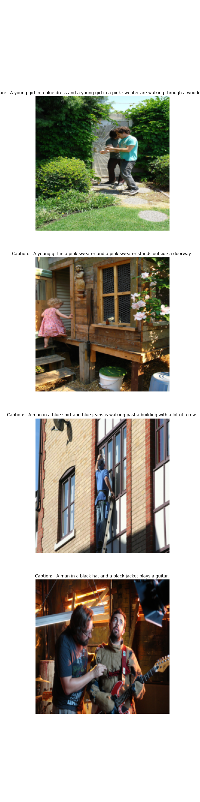
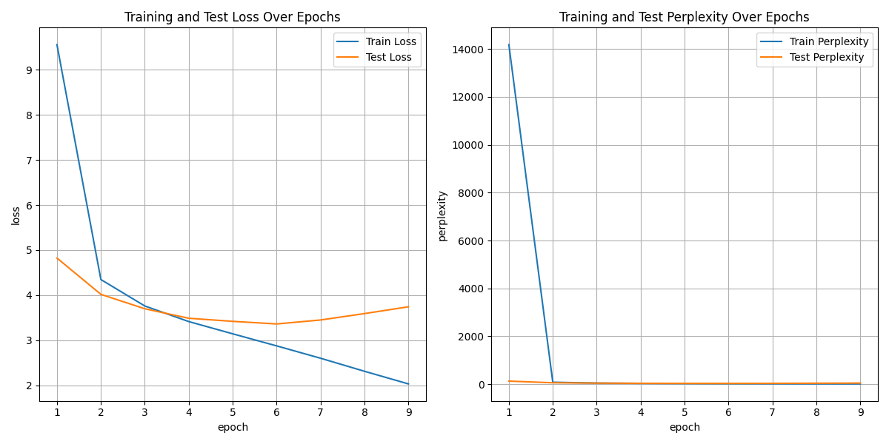

# **Image Caption Model Using Vision Transformer and Decoder**
- **Brief Description:** This model takes an image as input and generates a descriptive caption.

### **Table of Contents**
- Introduction
- Features
- Installation
- Usage
- Model Architecture
- Datasets
- Training
- Evaluation
- Results
- Contributing
- License
- Acknowledgements

## **Intorduction**
> In this project, we developed an image captioning model using a `Vision Transformer (ViT)` as the encoder and a `Transformer-based decoder`. The Vision Transformer encodes the images, and the decoder generates captions iteratively.

> The primary goal of this project is to create a model that can take images as input and generate descriptive captions, leveraging the power of transformer architectures.

## **Features**
- **Training Pipeline:** Comprehensive training pipeline with functions for training and evaluating the model.

- **Prediction Pipeline:** Predictive pipeline to generate captions after training.

- **Deployment Script:** Easy deployment using Streamlit for a user-friendly interface.

## **Installation**
- **Requirements:** All project dependencies are listed in the `requirements.txt` file.

- **Setup Instructions:** Clone the repository and install the required packages:
```bash
git clone https://github.com/pratyakshagarwal/Image-Caption-Model-Using-Vision-transformer-and-decoder.git
cd Image-Caption-Model-Using-Vision-transformer-and-decoder
pip install -r requirements.txt
```

## **Usage**

- **Running the Model:** Use the deployment script to run the model easily. Execute the following command:
```bash
streamlit run app.py
```

- **Training the Model:** If you want to train the model yourself, download the dataset from the link below and place it in your working directory. Then, run the following command:
```bash
python train.py
```
> Note: If you want to modify model or training parameters, be cautious as it may lead to errors.
- This will train your model and save it in the current working directory.

## **Model Architecture**
- **Overview:** The model uses a `Vision Transformer` to encode the images, and these encoded vectors are passed to the `decoder's cross-attention layer`. Before passing them to the decoder, the encoded vectors are transformed to match the decoder's dimensions using a neural network.
- **Diagram:**


## **Datasets**
The `Flickr30k` dataset is a standard benchmark for sentence-based image description. It includes 158k captions with 244k coreference chains, linking mentions of the same entities across different captions for the same image, and associating them with 276k manually annotated bounding boxes.
- [Flickr Image Dataset](https://www.kaggle.com/datasets/hsankesara/flickr-image-dataset)

## **Training**
- **Training Procedure:** A `Trainer` class handles the training process, requiring training parameters, model parameters, datasets (train and test), and a tokenizer as inputs. The model is trained for nine epochs, with the first two being frozen epochs where the Vision Transformer is not trained. The learning rate remains constant throughout. TensorBoard is integrated for visualizations. Metrics such as `CrossEntropyLoss and Perplexity` evaluate performance. The `Trainer` class logs metric values for every batch through progress bars.

## **Evaluation**
> After each training epoch, the model is evaluated using `CrossEntropyLoss and Perplexity metrics`.

## **Results**
- **Performance:** The table below summarizes the model's performance over nine epochs:
```plaintext
epoch  train_loss  test_loss  train_perplexity  test_perplexity  elapsed_time
    1    9.560091   4.823745      14187.137695       124.430183    947.996540
    2    4.347049   4.018485         77.250183        55.616760   1872.139906
    3    3.760170   3.698693         42.955750        40.394485   2873.441917
    4    3.414683   3.488083         30.407305        32.723145   3873.856828
    5    3.143021   3.419183         23.173771        30.544466   4874.781454
    6    2.875226   3.361895         17.729422        28.843794   5875.508302
    7    2.600982   3.449594         13.476965        31.487591   6875.503287
    8    2.311680   3.591445         10.091360        36.286480   7874.355850
    9    2.031243   3.742320          7.623554        42.195782   8872.380190
```

- **Metrics Visualization: **

    

## **Contributing**
>  We welcome contributions! You can report issues, suggest features, or submit pull requests to help improve the project. Feel free to use the code for personal projects or adaptations, and if you encounter any problems or have ideas for enhancements, please open an issue or submit a pull request. Your contributions are greatly appreciated!

## **License**
>  This project is licensed under the MIT License. You are free to use, modify, and distribute the code, as long as the original license and copyright notice are included. For more details, see the LICENSE file.

## **Acknowledgements**
> We would like to acknowledge the following resources that have been instrumental to this project:

- **Vision Transformer:** Inspired by the [vision transformer paper](https://arxiv.org/abs/2010.11929) by `Dosovitskiy et al`.
- **Attention is All You Need:** Based on concepts from the [Attention is All You Need paper](https://arxiv.org/abs/1706.03762)  by `Vaswani et al`.

## **Contact**
 >For questions, support, or further information, please contact:

- Pratyaksh Agarwal: pratyakshagarwal93@gmail.com
- [Linkedin](https://www.linkedin.com/in/pratyaksh-agarwal-3673b7282/)
 > If you need access to the trained model, please message me directly.
